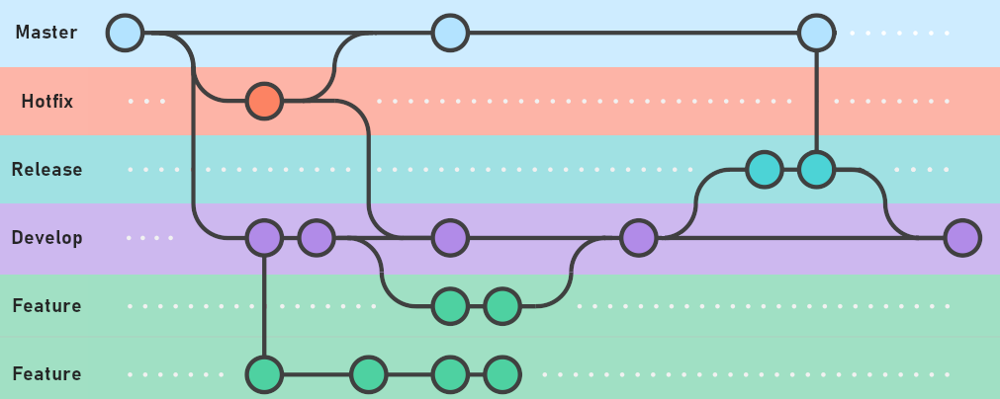

# Tech Challenge - API Gateway

## Visão Geral

Este repositório é dedicado ao armazenamento e gerenciamento do CI/CD para a infraestrutura do Kubernetes na AWS. 

A documentação principal do projeto está disponível em [Tech Challenge Backend](https://github.com/ed-wantuil/tech-challenge-backend).

## Recursos AWS Provisionados via Terraform

* **ECR:** Um serviço de registro de Docker que armazena e gerencia suas imagens de container de forma segura.
* **EKS:** Um serviço gerenciado de Kubernetes que facilita a implantação e operação de aplicações em containers.
* **Secrets Manager:** Gerencia e protege as credenciais usadas por aplicações e serviços na nuvem.

## Fluxo de Trabalho (Git Flow)

Utilizamos o Git Flow para organizar o desenvolvimento e manutenção do código:

- **Master/Main:** Código de produção, modificado apenas para lançamentos e correções críticas.
- **Develop:** Base para o desenvolvimento, onde novas funcionalidades são integradas.
- **Feature Branches:** Criados a partir do `develop` para desenvolvimento isolado de funcionalidades. Exemplo: `git checkout -b feature/compartilhamento develop`.
- **Release Branches:** Preparam a próxima versão para lançamento.
- **Hotfix Branches:** Resolvem bugs críticos em produção rapidamente.

> **Importante:** Todos os merges são feitos através de Pull Requests com, no mínimo, duas aprovações para garantir a integridade e qualidade do código.

## CI/CD Pipeline

O pipeline de CI/CD é acionado automaticamente após merges na branch principal. As etapas incluem:

- **Setup Terraform:** Configura o ambiente do Terraform, instala a versão correta e prepara as variáveis de ambiente.
- **Terraform Init:** Inicializa o projeto Terraform, configurando o backend e inicializando os módulos e plugins.
- **Terraform Plan:** Cria um plano detalhado das alterações de infraestrutura propostas.
- **Terraform Apply:** Aplica as alterações ao ambiente de destino, atualizando a infraestrutura conforme necessário.

As etapas de CI/CD asseguram que a Infraestrutura como Código (IaC) seja implementada de forma consistente e confiável.
